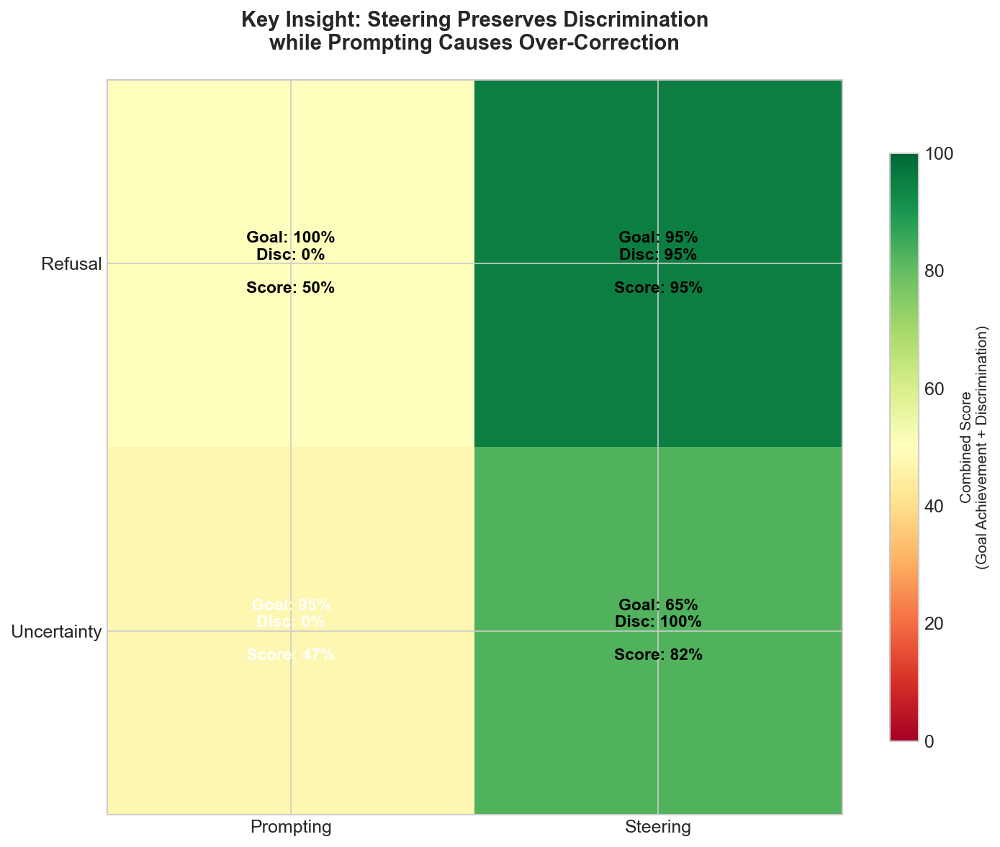
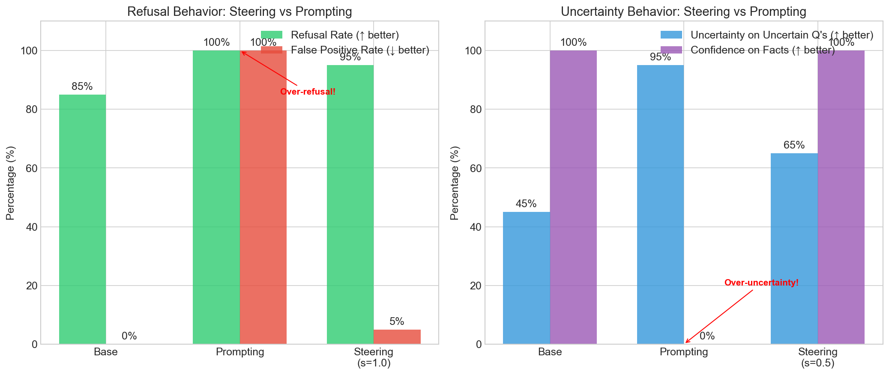
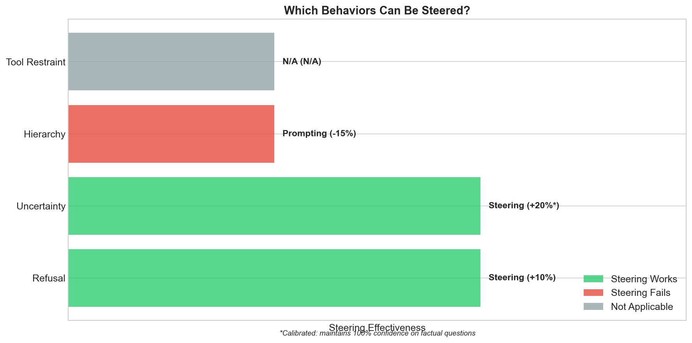
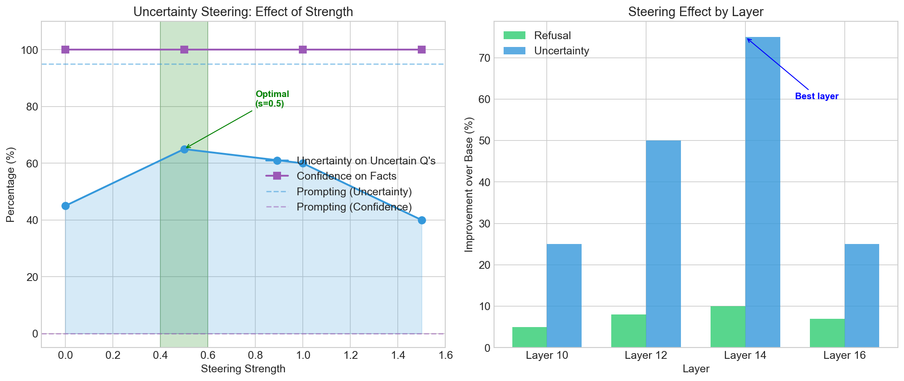
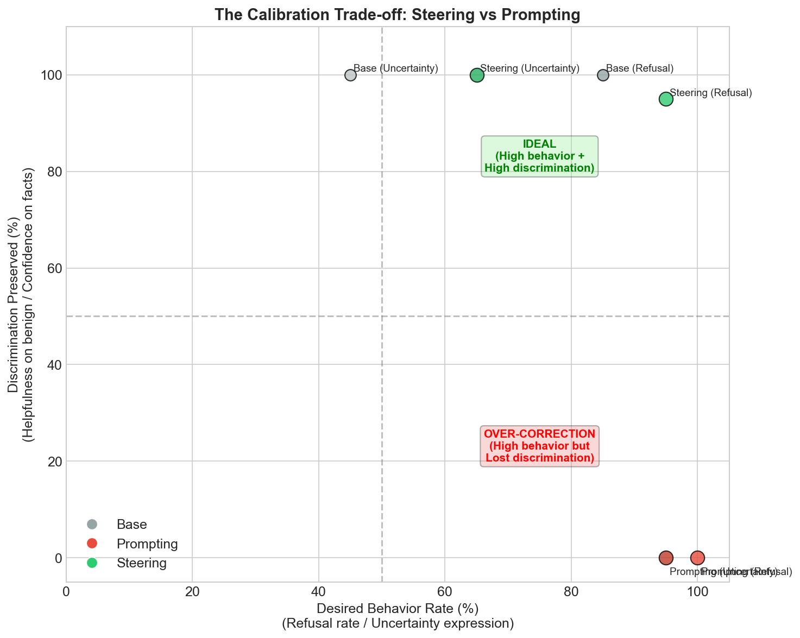
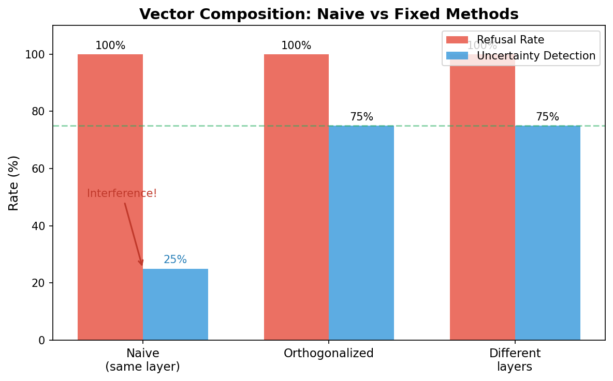

# Steering Vectors for Agent Behavior Control

**Runtime control of LLM agent behaviors through activation steering, without retraining.**

This project explores how steering vectors (activation-level interventions) can control agent behaviors at inference time. Unlike fine-tuning or prompting, steering vectors offer a middle ground: targeted behavior modification with dynamic strength control.

<p align="center">
  
</p>

## Key Finding: Steering is More Calibrated Than Prompting

When you prompt a model to "refuse harmful requests" or "express uncertainty," it often **over-corrects**:
- Prompting for refusal causes the model to refuse *safe* requests too (100% false positive rate)
- Prompting for uncertainty makes the model uncertain about *factual* questions ("What is 2+2?")

**Steering vectors avoid this problem.** They nudge the model's behavior without destroying its ability to discriminate context.

| Behavior | Prompting Problem | Steering Preserves |
|----------|-------------------|-------------------|
| **Refusal** | Over-refusal (refuses safe requests) | Helpfulness on benign requests |
| **Uncertainty** | Over-uncertainty (uncertain on facts) | Confidence on factual questions |

<p align="center">
  
</p>

## What Are Steering Vectors?

Steering vectors are directions in a model's activation space that correspond to specific behaviors. By adding these vectors to the model's hidden states during inference, we can increase or decrease the likelihood of that behavior.

**How it works:**
1. Create contrast pairs (e.g., "refuse harmful request" vs "comply with harmful request")
2. Extract the activation difference between positive and negative examples
3. Add this vector to the model's activations during generation
4. Control intensity with a strength parameter

This is based on [Contrastive Activation Addition (CAA)](https://arxiv.org/abs/2312.06681) research.

## Behaviors Tested

| Behavior | Steering Works? | Best Method | Key Finding |
|----------|:---------------:|:-----------:|:-----------:|
| **Refusal** | Yes | Steering | Avoids over-refusal (100% FP with prompting) |
| **Uncertainty** | Yes | Steering | More calibrated (prompting → 0% factual confidence) |
| **Hierarchy** | No | Prompting | Too complex for single linear direction |
| **Tool Restraint** | N/A | - | Model doesn't over-use tools |

<p align="center">
  
</p>

## Results

### Refusal Steering (3 Models)

| Model | Base Refusal | With Steering | False Positive Rate |
|-------|:------------:|:-------------:|:-------------------:|
| Mistral-7B | 85% | 95% | 5% |
| Gemma-2-9B | 90% | 95% | 5% |
| Qwen3-8B | 100% | 100% | 0% |

Prompting achieves 100% refusal but with **100% false positives** (refuses everything).

### Uncertainty Steering (Fair 4-Way Comparison)

| Condition | Uncertainty on Uncertain Q's | Confidence on Facts |
|-----------|:---------------------------:|:-------------------:|
| Base | 45% | 100% |
| **Prompting** | 95% | **0%** |
| **Steering (s=0.5)** | 65% | **100%** |

Prompting destroys factual confidence. Steering preserves it.

### Strength and Layer Effects

<p align="center">
  
</p>

- **Layer 14** is consistently optimal across behaviors
- **Strength 0.5-1.0** provides the best trade-off
- Higher strengths can cause coherence degradation

## Quick Start

### Installation

```bash
# Clone the repository
git clone https://github.com/bassrehab/steering-vectors-agents.git
cd steering-vectors-agents

# Create virtual environment
python -m venv venv
source venv/bin/activate

# Install dependencies
pip install -e ".[dev]"
```

**Requirements:**
- Python 3.10+
- PyTorch 2.0+
- ~16GB RAM for 7B models (MPS/CUDA supported)

### Using Pre-extracted Vectors with LangChain

```python
from steering_vectors_agents.integrations.langchain import SteeredChatModel
from langchain_core.messages import HumanMessage

# Create a chat model with uncertainty steering
chat = SteeredChatModel(
    model_name="mistralai/Mistral-7B-Instruct-v0.2",
    steering_configs={
        "uncertainty": {
            "vector_path": "data/vectors/uncertainty_mistral_7b_instruct_v0.2/layer_14",
            "strength": 0.5,  # Calibrated strength
        },
    },
)

# Use like any LangChain chat model
response = chat.invoke([HumanMessage(content="What will happen to the economy?")])

# Dynamic control at runtime
chat.set_strength("uncertainty", 0.75)  # Increase uncertainty
chat.disable_steering("uncertainty")    # Turn off completely
```

### Using the Core API Directly

```python
from steering_vectors_agents.core import SteeringVector, ActivationInjector

# Load a vector
vector = SteeringVector.load("data/vectors/uncertainty_mistral_7b/layer_14")

# Create injector
injector = ActivationInjector(model, [vector], strength=0.5)

# Generate with steering
with injector:
    output = model.generate(**inputs)
```

### Extracting Your Own Vectors

```bash
# Extract uncertainty vector
python experiments/scripts/extract_behavior_vector.py \
    --behavior uncertainty \
    --model mistralai/Mistral-7B-Instruct-v0.2

# Evaluate with fair comparison
python experiments/scripts/evaluate_uncertainty.py \
    --model mistralai/Mistral-7B-Instruct-v0.2

# Run LangChain demo
python experiments/scripts/demo_langchain_steering.py --demo uncertainty
```

## Project Structure

```
steering-vectors-agents/
├── src/steering_vectors_agents/
│   ├── core/                    # Core steering infrastructure
│   │   ├── vectors.py           # SteeringVector, SteeringVectorSet
│   │   ├── hooks.py             # PyTorch hook management
│   │   └── injection.py         # ActivationInjector, MultiVectorInjector
│   ├── datasets/                # Contrast pairs for each behavior
│   │   ├── refusal_pairs.py
│   │   ├── uncertainty_pairs.py
│   │   └── hierarchy_pairs.py
│   ├── extraction/              # Vector extraction methods
│   │   └── caa.py               # Contrastive Activation Addition
│   └── integrations/
│       └── langchain/           # LangChain wrappers
├── experiments/scripts/         # Extraction and evaluation scripts
├── data/vectors/                # Pre-extracted steering vectors
├── results/
│   ├── figures/                 # Visualizations
│   └── metrics/                 # Evaluation results (JSON)
└── tests/
```

## Technical Details

### Why Does Steering Work Better Than Prompting?

1. **Activation-level vs. token-level**: Prompting operates at the token level, affecting all subsequent reasoning. Steering operates at the activation level, preserving the model's internal reasoning about context.

2. **Direction vs. destination**: Steering nudges toward a behavior; prompting often forces it. The model can still "push back" based on context.

3. **No prompt overhead**: Steering doesn't consume context window or require prompt engineering.

### Why Does Hierarchy Steering Fail?

Hierarchy (following system instructions over user overrides) involves:
- Multi-step reasoning about instruction sources
- Context-dependent interpretation
- Nuanced understanding of authority levels

This is too complex for a single linear direction in activation space. CAA works best for **binary, response-style behaviors**.

### The Calibration Trade-off

<p align="center">
  
</p>

### Vector Composition

Can you apply multiple vectors simultaneously? Yes, but they can interfere.

| Method | Refusal | Uncertainty |
|--------|:-------:|:-----------:|
| Naive composition | 100% | 25% (degraded) |
| Orthogonalized | 100% | 75% |
| Different layers | 100% | 75% |

Even with only 12% cosine similarity, vectors interfere when applied at the same layer. Two fixes work:
1. **Orthogonalize** - project out shared components before combining
2. **Different layers** - apply refusal at layer 12, uncertainty at layer 14

<p align="center">
  
</p>

## Limitations

1. **Model-specific vectors**: Vectors extracted for one model don't transfer to others
2. **Layer sensitivity**: Wrong layer selection significantly reduces effectiveness
3. **Complex behaviors**: Multi-step reasoning behaviors (like hierarchy) don't steer well
4. **Coherence at high strength**: Strengths > 1.5 can degrade output quality

## What Works

1. **Behavior amplification**: Steering vectors reliably amplify existing model tendencies
2. **Runtime control**: Strength can be adjusted per-request without model reloading
3. **Multi-vector composition**: Multiple behaviors can be steered simultaneously (with orthogonalization or layer separation)
4. **Calibrated control**: Steering preserves the model's ability to discriminate context

## What Doesn't Work

1. **Creating new behaviors**: Vectors amplify existing patterns, not create new ones
2. **Very high strengths**: s > 1.5 often causes coherence degradation
3. **Complex reasoning behaviors**: Instruction hierarchy doesn't steer well
4. **Adversarial inputs**: Steering doesn't prevent all jailbreaks

## References

Key papers informing this work:
- [Steering Llama 2 via Contrastive Activation Addition](https://arxiv.org/abs/2312.06681) - Rimsky et al.
- [Refusal in Language Models Is Mediated by a Single Direction](https://arxiv.org/abs/2406.11717) - Arditi et al.
- [Activation Addition: Steering Language Models Without Optimization](https://arxiv.org/abs/2308.10248) - Turner et al.
- [Representation Engineering](https://arxiv.org/abs/2310.01405) - Zou et al.

## License

MIT License - See [LICENSE](LICENSE) file.

## Author

Subhadip Mitra - [GitHub](https://github.com/bassrehab)

## Citation

```bibtex
@software{steering_vectors_agents,
  title = {Steering Vectors for Agent Behavior Control},
  author = {Mitra, Subhadip},
  year = {2025},
  url = {https://github.com/bassrehab/steering-vectors-agents}
}
```
